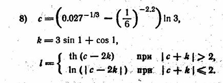
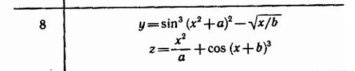


## Фотографии заданий

+ 
+ 

## Файлы для word (все формировал DeepSeekGPT)

+ part_1_ln_nan - объясняет почему ln нельзя посчитать и вывести.
+ math_model - математическая модель для двух программ
+ vars - все переменные в программе (чтобы просто вставить и не ебать тебе мозг).
+ input_output - решил ввод и вывод не в программе вставлять, а отдельно вынести
+ odz - ОДЗ.
+ questions - контрольные вопросы и ответы на них.
